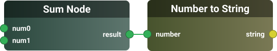

# **@Fluxo**
*A flexible, modular, fast, and lightweight workflow engine.*  

Fluxo is a powerful framework designed for building and executing workflows using a node-based architecture. It enables seamless process automation by connecting nodes and edges (via handles), ensuring efficiency, scalability, and adaptability.

## **Features**  
🧩 **Modular Execution** – Define custom executors for different node types.

🔗 **Edge-Based Flow** – Nodes are connected via handles, specifying `sourceValue` and `targetValue` for mapping inputs and outputs.

🔄 **Loop Execution** – Special support for loop-based nodes where all child nodes execute in a loop.

⚡️ **Lightweight & Fast** – Designed for performance with minimal overhead.  

## **📦 Installation**  
To install Fluxo, run:

```sh
pnpm add @fluxo-engine/core
```

## **💡 Usage Examples**

### **🔧 1. Function-Based Executors** 

#### **Standard Node Execution**

```ts
import { NodeExecutor } from '@fluxo-engine/core';
import { NodeTypes } from './types';

const simpleExecutor: NodeExecutor<NodeTypes> = {
  type: NodeTypes.SIMPLE,
  async execute(input, data) {
    // Process the input and return output
    return { result: (input.num0 as number) + (input.num1 as number) };
  },
};
```

#### **Loop Execution (Special Behavior)** 🔄

> **Note:** The `LoopExecutor` iterates over an array and executes all nodes within its loop hierarchy for each iteration.

```ts
import { LoopNodeExecutor } from '@fluxo-engine/core';
import { NodeTypes } from './types';

const loopExecutor: LoopNodeExecutor<NodeTypes> = {
  type: NodeTypes.LOOP,
  isLoopExecutor: true,
  async getArray(input, data, iteration) {
    // Generate an array of outputs to iterate over
    return Array.from({ length: input.count as number }, (_, i) => ({ index: i }));
  },
};
```

### **🏗️ 2. Class-Based Executors** 

You can also define executors as classes by implementing the respective interfaces.

#### **Standard Node Executor with a Class**

```ts
import { NodeExecutor } from '@fluxo-engine/core';
import { NodeTypes } from './types';

class SimpleNodeExecutor implements NodeExecutor<NodeTypes> {
  type = NodeTypes.SIMPLE;

  async execute(input: { num0: number; num1: number }, data: Record<string, unknown>) {
    // Execute node logic and return output
    return { result: input.num0 + input.num1 };
  }
}

// Instantiate and export the executor
export const simpleNodeExecutor = new SimpleNodeExecutor();
```

#### **Loop Executor with a Class**

```ts
import { LoopNodeExecutor } from '@fluxo-engine/core';
import { NodeTypes } from './types';

class SimpleLoopExecutor implements LoopNodeExecutor<NodeTypes> {
  type = NodeTypes.LOOP;
  isLoopExecutor = true;

  async getArray(
    input: { count: number },
    data: Record<string, unknown>,
    iteration?: number
  ) {
    // Generate an array to loop over; each iteration returns an object with an index
    return Array.from({ length: input.count }, (_, i) => ({ index: i }));
  }
}

// Instantiate and export the executor
export const simpleLoopExecutor = new SimpleLoopExecutor();
```

### **🔄➡️ 3. Defining and Executing a Flow** 

A **flow** consists of nodes and edges defining the execution order. **Edges** now include `sourceValue` and `targetValue` (handles) to map outputs of one node to inputs of another.

#### **Example Flow:**



#### **Edge Mapping:**  
The edge will connect the `result` handle of the "sum" node to the `number` handle of the "number_to_string" node:

```ts
import { getFlowHandler } from '@fluxo-engine/core';
import { simpleNodeExecutor } from './SimpleNodeExecutor'; // class-based
import { simpleLoopExecutor } from './SimpleLoopExecutor'; // class-based

enum NodeTypes {
  SUM = 'sum',
  NUMBER_TO_STRING = 'number_to_string',
};

// Define flow handler with your executors (you can mix function-based and class-based)
const flowHandler = getFlowHandler({
  executors: [simpleNodeExecutor, simpleLoopExecutor],
  enableLogger: true,
});

// Define nodes
const nodes = [
  {
    id: 'sum',
    type: NodeTypes.SUM,
    input: { num0: 5, num1: 7 },
    output: {},
  },
  {
    id: 'number_to_string',
    type: NodeTypes.NUMBER_TO_STRING,
    input: { number: null }, // value will be set via edge mapping
    output: {},
  },
];

// Define edges with handles mapping
const edges = [
  {
    source: 'sum',
    target: 'number_to_string',
    sourceValue: 'result',   // the output handle from the "sum" node
    targetValue: 'number',   // the input handle of the "number_to_string" node
  },
];

// Execute the flow
await flowHandler.execute({ nodes, edges });
```

## **🔄✨ Special Behavior of LoopExecutor**

The **Loop Executor** (`isLoopExecutor: true`) has a unique execution pattern:
- **Iteration:** It iterates over an array generated by the `getArray` method.
- **Nested Execution:** All nodes within the loop's hierarchy are executed for each iteration.
- **Data Propagation:** Enables repetitive or batch processing seamlessly within your workflow.

## **🚀 Why Use Fluxo?** 

- **Flexible:** Easily define any node behavior via custom executors.  
- **Efficient:** Minimal overhead ensures fast execution of workflows.  
- **Scalable:** Capable of handling both simple and complex workflow scenarios.  
- **Precise Data Mapping:** Use handles (`sourceValue` and `targetValue`) to clearly define how outputs feed into inputs across nodes.


